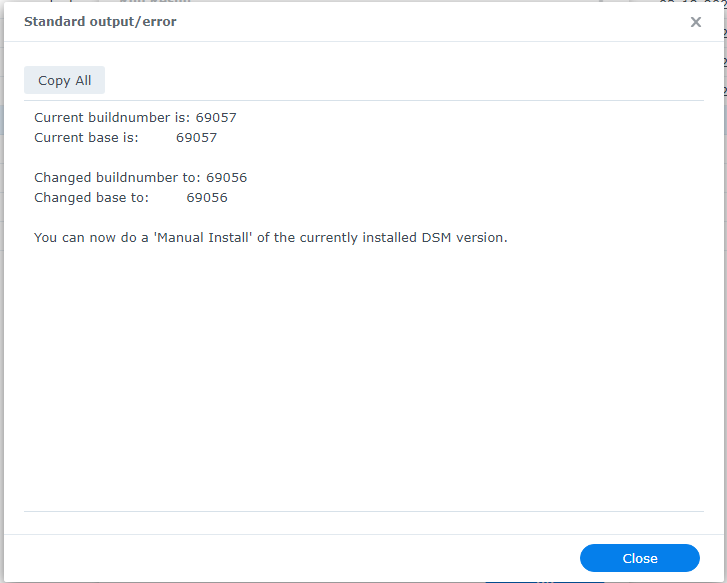

# How to see the output of a script run in Synology Task Scheduler

After <a href=how_to_run_from_scheduler.md/>running a script in Synology Task Scheduler</a> to view the putput of the script follow these steps:

1. Go to **Control Panel** > **Task Scheduler**.
2. Select the scheduled task.
3. Click **Action** then **View Result**.
7. In the **Standard output/error** section click on the **View Details** link.

You should then see the script's output:

